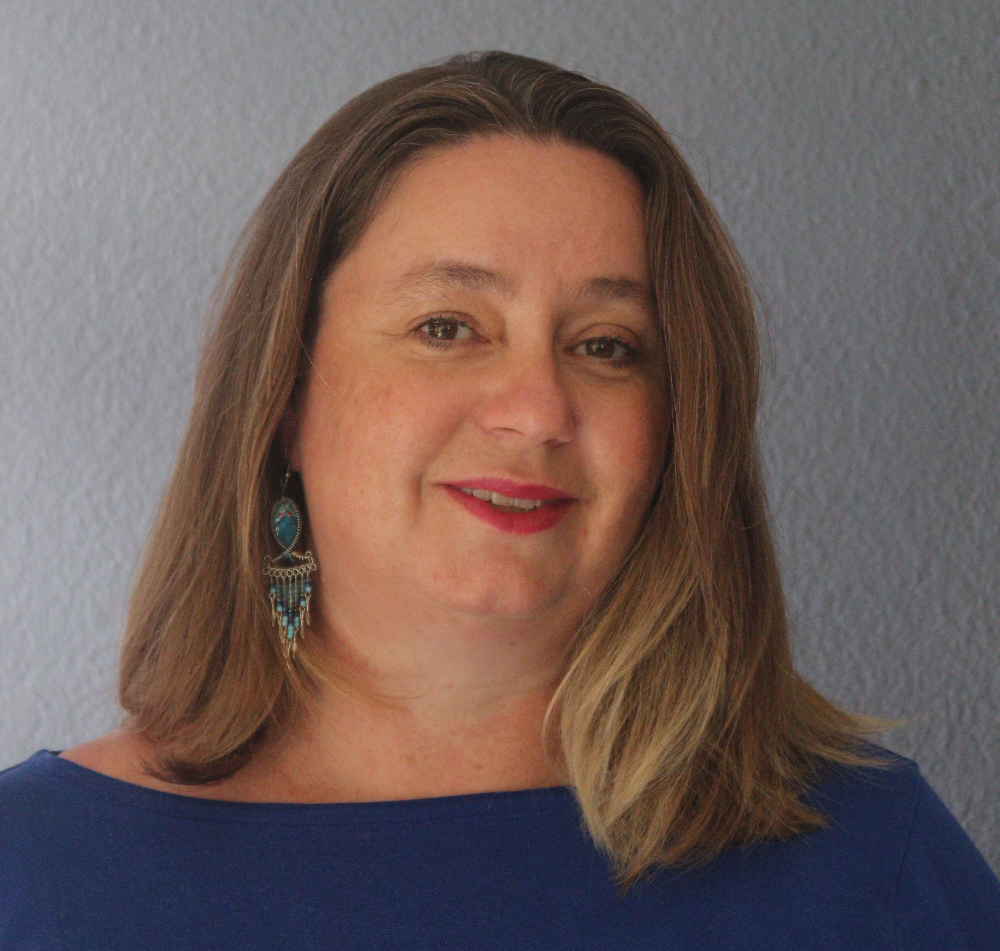

::: {layout="[30,70]" .align-items-start}

{.headshot fig-alt="Portrait of Michelle Manes"}

::: {}
I'm a mathematician working in **arithmetic dynamics**, with broader interests
across number theory, arithmetic geometry, and dynamical systems. I care deeply
about mathematics education, mentoring, and building research communities —
especially ones that widen who gets to do mathematics.

<!-- Update your current affiliation / title here as it changes. -->
*Current position: [add title and institution].*

[CV (PDF)](cv/manes-cv.pdf) &nbsp;·&nbsp;
[Google Scholar](https://scholar.google.com/citations?user=KlfuQQIAAAAJ) &nbsp;·&nbsp;
[arXiv](https://arxiv.org/a/manes_m_1) &nbsp;·&nbsp;
[email](mailto:michelle.manes@gmail.com)
:::

:::

## About

My research is primarily in arithmetic dynamics — the study of number-theoretic
and arithmetic-geometric questions arising from iterating rational maps. I earned
my Ph.D. at Brown University under Joseph H. Silverman, and I've since worked at
the University of Hawai‘i and as a program director for algebra and number theory
at the National Science Foundation. I'm an AWM Fellow (2020) and have helped lead
the Women in Numbers (WIN) network.

Before returning to graduate school, I spent a decade as a mathematics educator,
and that experience still shapes how I think about teaching, outreach, and access
to mathematics.

<!--
  Tip: keep this page short. It's the first thing visitors read.
  Anything longer (a full bio, awards list) can live on the CV or its own page.
-->
